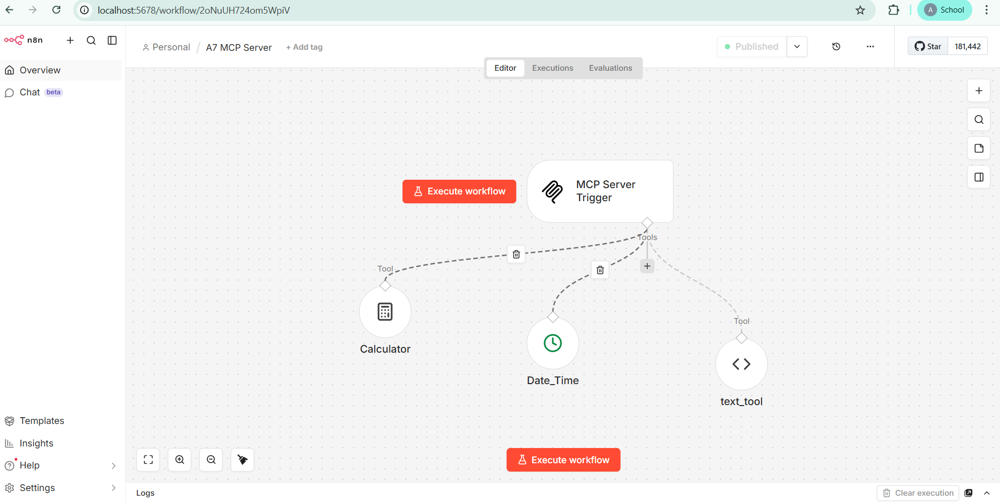
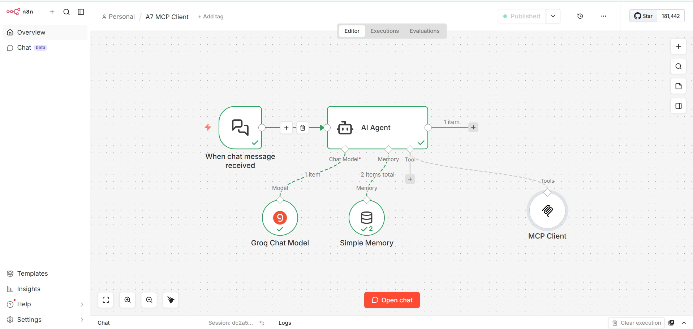
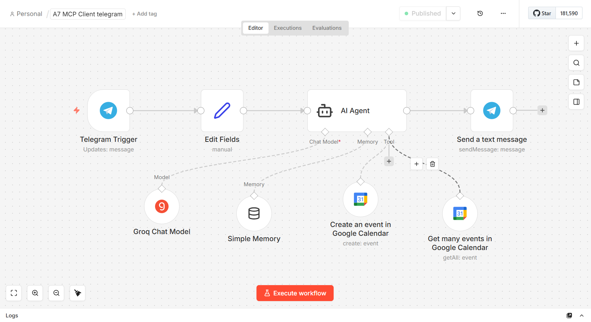
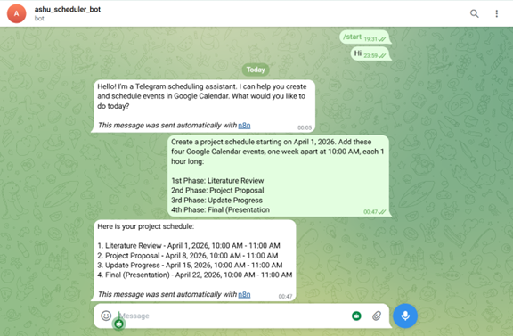
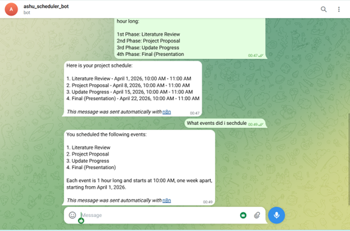
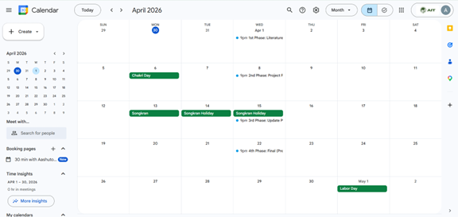
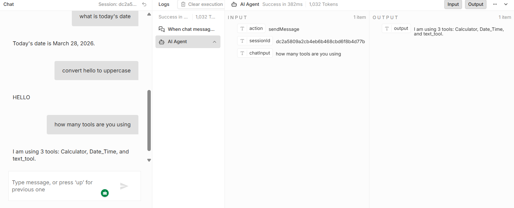

# A7 – MCP + n8n Automation

**Name:** Ashutosh Raut  
**Student ID:** st126438  
**Course:** NLP 2026  

---

## Overview

This project implements a Model Context Protocol (MCP) system using n8n. It demonstrates how an AI Agent can dynamically interact with external tools and real-world services.

The system consists of:
- an MCP Server that exposes tools
- an MCP Client (AI Agent) that decides when to use them
- Telegram integration for user interaction
- Google Calendar integration for scheduling tasks

---

## System Architecture

The overall system follows a client-server architecture based on MCP:

1. The user sends a query to the AI Agent.
2. The AI Agent processes the request using the Groq Chat Model.
3. If a tool is needed, the AI Agent sends the request through the MCP Client.
4. The MCP Client communicates with the MCP Server using the Production URL.
5. The MCP Server routes the request to the correct tool.
6. The tool executes and returns the result.
7. The MCP Client passes the result back to the AI Agent.
8. The AI Agent returns the final response to the user.

---

## MCP Server

The MCP Server is implemented in n8n and exposes the following tools:

- **Calculator** — performs arithmetic operations
- **Date_Time** — retrieves the current date and time
- **text_tool** — performs text transformations such as uppercase conversion

### MCP Server Workflow



---

## MCP Client (AI Agent)

The MCP Client is implemented using:

- **AI Agent**
- **Groq Chat Model**
- **Simple Memory**
- **MCP Client node**

The AI Agent determines when a tool is required and invokes it dynamically through the MCP Client.

### MCP Client Workflow



---

## Public MCP Endpoint

The MCP Server is exposed publicly using ngrok.

```
https://unameliorable-tressy-jacalyn.ngrok-free.dev/mcp/53486799-8226-4f13-b03d-0fe0324d0f45
```

> Note: ngrok URLs may change between sessions.

---

## Workflow Files (JSON)

The `workflows/` folder contains exported n8n workflow JSON files that can be imported into n8n to reproduce the system.:

- `mcp_server.json`
- `mcp_client.json`
- `telegram_agent.json`

> Note: Credentials are not included. Configure your own API keys.

---

## Features

- Dynamic MCP tool invocation  
- AI Agent with natural language understanding  
- Telegram chatbot integration  
- Google Calendar automation  

---

## Setup Instructions

### Run n8n

```
docker run -it --rm -p 5678:5678 n8nio/n8n
```

### Run ngrok

```
ngrok http 5678
```

### Import workflows

Import JSON files into n8n and configure credentials.

---

## Telegram Integration
Users can:
- send scheduling requests in natural language
- create project schedules automatically
- retrieve scheduled events from Google Calendar








---

## Google Calendar

The AI Agent creates project schedules automatically.



---

## Results

### Task 1
- Calculator works (2 + 2 → 4)
- Date tool works
- Text tool works



### Task 2
- Telegram bot works
- Events created successfully
- Calendar retrieval works

---

## Event Summary

| Event | Date | Time | Description |
|------|------|------|-------------|
| 1st Phase: Literature Review | April 1, 2026 | 10:00–11:00 | Review related papers |
| 2nd Phase: Project Proposal | April 8, 2026 | 10:00–11:00 | Prepare proposal |
| 3rd Phase: Update Progress | April 15, 2026 | 10:00–11:00 | Present progress |
| 4th Phase: Final Presentation | April 22, 2026 | 10:00–11:00 | Final demo |

---

## Repository Structure

```
A7-MCP-n8n/
├── workflows/
│   ├── mcp_server.json
│   ├── mcp_client.json
│   └── telegram_agent.json
│
├── results_2/
│   ├── mcp_server.png
│   ├── mcp_client_2.png
│   ├── MCP_telegram_workflow.png
│   ├── Testing_telegram_1.png
│   ├── Testing_telegram_2.png
│   ├── Testing_calender.png
│   └── mcp_task_1_output.png
│
├── README.md
├── report.pdf
└── docker-compose.yml
```

---

## Conclusion

This project demonstrates how AI agents can integrate with external tools to perform real-world tasks like scheduling and automation.
